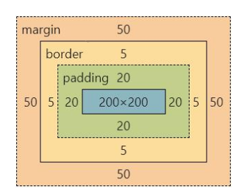

# CSS

层叠样式表 (Cascading Style Sheets，缩写为 CSS），是一种样式表语言，用来描述 HTML 文档的呈现（美化内容）。

书写位置：`title` 标签下方添加 `style` 双标签，`style` 标签里面书写 CSS 代码。

## 引入方式

- 内部样式表：CSS 代码写在 Style 标签中
- 外部样式表：写在单独 `.css` 文件中，引入 `<link rel="stylesheet" href="./my.css">`
- 行内样式：卸载标签的 style 属性中，`<div style="color: red; font-size: 20px;">这是 div 标签</div>`

## 选择器

作用：查找标签，设置样式。

### 标签选择器

使用标签名作为选择器 → 选中同名标签设置相同的样式。

~~~html
<style>
    p {
    	color: red;
    }
</style>
~~~

无法差异化同名标签的显示效果。

### 类选择器

作用：查找标签，差异化设置标签的显示效果。

~~~html
<style>
    /* 定义类选择器 */
    .red {
    	color: red;
    }
</style>

<!-- 使用类选择器 -->
<div class="red">这是 div 标签</div>
~~~

步骤：

- 定义类选择器 → .类名
- 使用类选择器 → 标签添加 class="类名"

注意：类名用英文、**一个类选择器可以供多个标签使用**、一个标签可以使用多个类名，类名之间用空格隔开。

### id 选择器

场景：id 选择器一般配合 JavaScript 使用，很少用来设置 CSS 样式

同一个 id 选择器在一个页面只能使用一次

~~~html
<style>
	/* 定义 id 选择器 */
    #red {
    	color: red;
    }
</style>

<!-- 使用 id 选择器 -->
<div id="red">这是 div 标签</div>
~~~

### 通配符选择器

作用：查找页面所有标签，设置相同样式。

通配符选择器： `*`，不需要调用，浏览器**自动查找页面所有标签**，设置相同的样式

~~~css
* {
	color: red;
}
~~~

经验：通配符选择器可以用于清除标签的默认样式，例如：标签默认的外边距、内边距

~~~html
* {
	margin: 0;
	padding: 0;
}
~~~

### 复合选择器

定义：由两个或多个基础选择器，通过不同的方式组合而成。

作用：更准确、更高效的选择目标元素（标签）。

~~~html
<span>span 标签</span>

<div>
	<span>文字颜色是绿色</span>
</div>
~~~

#### 后代选择器

后代选择器：选中某元素的后代元素。

选择器写法：父选择器 子选择器 { CSS 属性 }，父子选择器之间用空格隔开。

~~~css
<style>
    div span {
        color: red;
    }
</style>

<span> span 标签</span>

<div>
	<span>这是 div 的儿子 span </span>
</div>
~~~

#### 子代选择器

子代选择器：选中某元素的子代元素（最近的子级）。

选择器写法：父选择器 > 子选择器 { CSS 属性}，父子选择器之间用 > 隔开

~~~html
<style>
    div > span {
    	color: red;
    }
</style>
~~~

#### 并集选择器

并集选择器：选中多组标签设置相同的样式。

选择器写法：选择器1, 选择器2, …, 选择器N { CSS 属性}，选择器之间用 , 隔开。

~~~html
<style>
    div, p, span {
    	color: red;
    }
</style>

<div> div 标签</div>
<p>p 标签</p>
<span>span 标签</span>
~~~

#### 伪类选择器

伪类选择器：伪类表示元素状态，选中元素的某个状态设置样式。

鼠标悬停状态：选择器:hover { CSS 属性 }

~~~html
<style>
    a:hover {
        color: red;
    }
    
    .box:hover {
        color: green;
    }
</style>

<a href="#">a 标签</a>
<div class="box">div 标签</div>
~~~

超链接-伪类：

- `:link`
- `:visited`
- `:hover`
- `:active`

### 结构伪类选择器

作用：根据元素的结构关系查找元素。

~~~shell
# 查找 E 的第一次元素
E:first-child 

# 查找 E 的最后一个元素
E:last-child 

# 查找第 N 个 E 元素
# 2n、2n + 1、5n、n+5
E:nth-child(N)
~~~

### 伪元素选择器

创建虚拟元素（伪元素），用来摆放装饰性的内容

~~~shell
E::before
E::after
~~~

案例：

其中 content 为伪元素内容，没有用空字符串。伪元素默认为行内。权重=标签选择器。

~~~css
p::before {
  content: "【前缀】";
  color: red;
}
~~~

## 文字属性

### 字体大小 font-size

~~~css
p {
	font-size: 30px;
}
~~~

### 字体粗细 font-weight

可以使用数字、或者 `normal、bold`

~~~css
/*
不加粗 */
font-weight: 400;
/*
加粗 */
font-weight: 700;
~~~

### 字体样式 font-style

`font-style`：

- 正常：normal
- 倾斜：italic

### 行高 line-height

行高为：上间距 + 下间距 + 文本高度。

~~~css
line-height: 30px;

/* 数字时，是当前标签字体大小的倍数 */
line-height: 2;
~~~

垂直居中技巧：行高属性值等于盒子高度属性值

### 字体族 font-family

~~~css
font-family: Microsoft YaHei, Heiti SC, tahoma, arial, Hiragino Sans GB, "\5B8B\4F53", sans-serif;
~~~

`font-family` 属性值可以书写多个字体名，各个字体名用逗号隔开，执行顺序是从左向右依次查找。

`font-family` 属性最后设置一个字体族名，网页开发建议使用无衬线字体。

### 文本缩进 text-indent

~~~css
p {
	text-indent: 5px;
}

p {
	text-indent: 2em; <!-- 当前标签的字号大小 -->
}
~~~

### 文本对齐方式 text-align

`left、center、right`

~~~css
text-align: center;
~~~

### 文本修饰线 text-decoration

- none：无
- underline：下划线
- line-through：删除线
- overline：上划线

### 文字颜色 color

- 关键字：red、green
- rgb：(255,255, 255)
- rgba：a 表示透明度
- 十六进制：#000000

## CSS 特性

CSS特性：化简代码 / 定位问题，并解决问题

- 继承性：子级默认继承父级的文字控制属性
- 层叠性：相同属性覆盖（写在后面的覆盖前面的）、不同属性叠加（都生效）
- 优先级：通配符选择器 < 标签选择器 < 类选择器 < id选择器 < 行内样式 < !important

## 背景属性

### 背景色 background-color

### 背景图 background-image

~~~css
div {
    width: 400px;
    height: 400px;
    background-image: url(./images/1.png);
}
~~~

### 背景图平铺方式 background-repeat（bgr)

- no-repeat
- repeat
- repeat-x
- repeat-y

### 背景图位置 background-position（bgp）

- 关键字：left、right、center、top、bottom
- 坐标：数字 + px

~~~css
div {
    width: 400px;
    height: 400px;
    background-color: pink;
    background-image: url(./images/1.png);
    background-repeat: no-repeat;
    background-position: center bottom;
    background-position: 50px -100px;
    background-position: 50px center;
}
~~~

可以只写一个关键字，另一个方向默认为居中；数字只写一个值表示水平方向，垂直方向为居中。

### 背景图缩放 background-size（bgz）

- 关键字
  - cover：等比例缩放背景图片以完全覆盖背景区，可能背景图片部分看不见
  - contain：等比例缩放背景图片以完全装入背景区，可能背景区部分空白
- 百分比：根据盒子尺寸计算图片大小
- 数字 + 单位（例如：px）

工作中，图片比例与盒子比例相同，使用 cover 或 contain 缩放背景图效果相同。

### 背景图固定 background-attachment（bga）

属性值：`fixed`

### 复合属性

~~~css
div {
    background: pink url(./images/1.png) no-repeat right center/cover;
}
~~~

## 显示模式

https://blog.csdn.net/m0_73941339/article/details/146288203

### 块级元素

- 独占一行：默认情况下，块元素会从新的一行开始，并且其后的元素也会被推到下一行
- **宽度**默认是父级的100%
- 添加宽高属性生效：可以自由设置宽度（`width`）和高度（`height`），并控制内外边距（`margin`、`padding`）

常见块元素：

~~~css
<div>, <p>, <h1>~<h6>, <ul>, <ol>, <li>, <table>, <form>, <header>, <footer>, <nav>, <article>, <section>
~~~

### 行内元素

- **水平排列**：多个行内元素会水平排列在同一行，直到行内空间用完才会换行。
- **无法设置宽高**：直接设置`width`和`height`无效，元素宽度由内容决定。
- **垂直对齐问题**：行内元素默认以基线（baseline）对齐，可能导致布局不整齐。
- **只能容纳文本或行内元素**：不能包含块元素。

常见的行内元素：

~~~css
<span>, <a>, <strong>, <em>, <i>, <b>, （特殊，实为行内块），<input>（特殊，实为行内块）
~~~

### 行内块元素

行内块元素兼具块元素和行内元素的特点：

- **水平排列**：与行内元素或行内块元素在同一行显示。
- **可设置宽高**：可以自由设置`width`、`height`和`margin`、`padding`。
- **默认宽度由内容决定**：宽度和高度默认由内容撑开，但可以手动调整。

display:

- 快级：block
- 行内：inline
- 行内块：inline-block

常见的行内块：

~~~css
, <input>, <button>, <textarea>, <select>
~~~

## 盒子模型

盒子组成部分：

- 内容区域：width、height
- 内边距：padding
- 变线框：border
- 外边距：margin

~~~css
div {
    margin: 50px;
    border: 5px solid brown;
    padding: 20px;
    width: 200px;
    height: 200px;
    background-color: pink;
}
~~~



### 边框线

border(bd)：

- solid：实线
- dashed：虚线
- dotted：点线

### 内边距

设置 **内容** 与 **盒子边缘** 之间的距离。

属性名：padding / padding-方位名词。

~~~css
div {
    /* 四个方向 内边距相同 */
    padding: 30px;
    /* 单独设置一个方向内边距 */
    padding-top: 10px;
    padding-right: 20px;
    padding-bottom: 40px;
    padding-left: 80px;
    width: 200px;
    height: 200px;
    background-color: pink;
}
~~~

多值赋值：从上开始顺时针赋值，当前方向没有数值则与对面取值相同。

### 尺寸计算

盒子尺寸 = 内容尺寸 + border 尺寸 + 内边距尺寸

给盒子加 border / padding 会撑大盒子

`box-sizing`： border-box 就是将 border 和 padding 数值包含在 width 和 height 之内，这样的好处就是修改 border 和 padding 数值盒子的大小不变。

### 外边距

作用：拉开两个盒子之间的距离 margin。

技巧：版心居中 – 左右 margin 值 为 auto（盒子要有宽度）

### 清除默认样式

清除标签默认的样式，比如：默认的内外边距。

~~~css
/* 清除默认内外边距号 */
* {
    margin: 0;
    padding: 0;
    box-sizing: border-box;
}

/* 清除列表项目符号 */
li {
	list-style: none;
}
~~~

### 元素溢出

作用：控制溢出元素的内容的显示方式。 overflow

- `visible`（默认值）：内容不会被裁剪，依然会显示在容器外部。
- `hidden`：隐藏溢出的内容，不会显示滚动条。
- `scroll`：始终显示滚动条（无论是否溢出）。
- `auto`：**自动**显示滚动条（仅在内容溢出时显示）

### 外边距问题 – 合并现象

场景：垂直排列的兄弟元素，上下 margin 会合并。

现象：取两个 margin 中的较大值生效。

~~~css
.one {
    margin-bottom: 50px;
    background-color: red;
}

.two {
    margin-top: 20px;
    background-color: yellow;
}
~~~

这里两个外边距就是 50 px

### 外边距问题 – 塌陷问题

场景：父子级的标签，子级的添加上外边距会产生塌陷问题

现象：导致父级一起向下移动

解决方法：

- 取消子级 margin，父级设置 padding
- 父级设置 overflow: hidden
- 父级设置 border-top

### 行内元素 - 内外边距问题

场景：行内元素添加 margin 和 padding，无法改变元素垂直位置。

解决方法：给行内元素添加 line-height 可以改变垂直位置。

~~~css
span {
	/* margin 和 padding 属性，无法改变垂直位置 */
    margin: 50px;
    padding: 20px;
    
	/* 行高可以改变垂直位置 */
	line-height: 100px;
}
~~~

### 圆角

作用：设置元素的外边框为圆角。

属性名：border-radius

属性值：数字+px / 百分比

提示：属性值是圆角半径

技巧：从左上角开始顺时针赋值，当前角没有数值则与对角取值相同。

## 浮动

CSS 提供了 **3 种机制** 来设置盒子的摆放位置，分别是**普通流**（标准流）、**浮动**和**定位**，其中：

- **普通流**（标准流）：块级、行内、行内块
- **浮动**：让盒子从普通流中**浮**起来，主要作用让多个块级盒子一行显示。
- **定位：**将盒子**定**在浏览器的某一个**位**置——CSS 离不开定位，特别是后面的 js 特效。

为什么需要浮动：

多个 div 水平排列成一行：


如何实现盒子的左右对齐：


**浮动概念：**元素的浮动是指**设置了浮动属性的元素会**：

1. 脱离标准普通流的控制
2. 移动到指定位置

作用：**让多个盒子 (div) 水平排列成一行**，使得浮动成为布局的重要手段。

~~~css
选择器 { 
    float: 属性值;  /*none：默认，不浮动； left、right*/
}
~~~

浮动特点：

```
元素添加浮动属性之后
1.当前元素会脱离标准流的控制，俗称脱标
2.脱标以后将自己原来的位置漏给了下方标准流的盒子
3.浮动的元素脱标之后，会具有行内块的属性(控制宽高，可以一行显示多列)
```

**注意： 浮动的元素互相贴靠一起的，但是如果父级宽度装不下这些浮动的盒子， 多出的盒子会另起一行对齐**

~~~css
.box1 {
    width: 150px;
    height: 150px;
    background-color: red;
    float: left;
}

.box2 {
    width: 200px;
    height: 200px;
    background-color: green;
}
~~~

